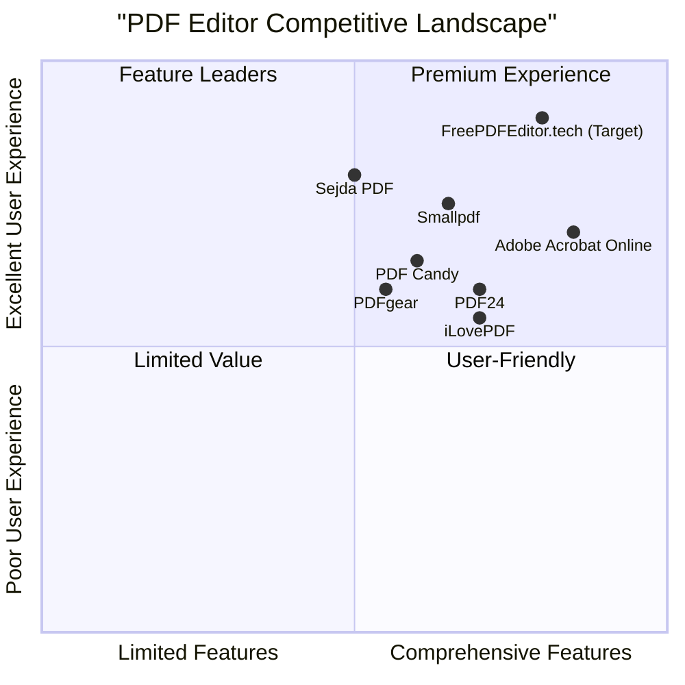

# Product Requirements Document (PRD): FreePDFEditor.tech

## Project Information

**Project Name:** FreePDFEditor.tech  
**Version:** 1.0  
**Last Updated:** 2025-05-21  
**Programming Language:** Next.js, TypeScript, Tailwind CSS  

## Original Requirements

Build a free, AI-powered, SEO-optimized PDF SaaS web application using Next.js, TypeScript, Tailwind CSS, and MetaGPT X. The application should support full PDF operations (edit, convert, compress, merge, split, rotate, etc.) with a clean and fast user experience. It should rank on Google for high-intent and long-tail keywords and offer AI tools like summarization, OCR, and chat-with-PDF.

## 1. Product Definition

### 1.1 Product Goals

1. **User Accessibility:** Create a barrier-free, feature-rich online PDF editor that requires no downloads, installations, or sign-ups, making document editing accessible to everyone regardless of technical expertise.

2. **AI Integration:** Leverage artificial intelligence to enhance PDF workflows beyond traditional editing, offering smart features like document summarization, text extraction, and interactive PDF chat capabilities.

3. **SEO Market Dominance:** Establish FreePDFEditor.tech as the top-ranking free PDF editor for high-intent search terms through strategic SEO optimization, delivering exceptional user experience without hidden costs or limitations.

### 1.2 User Stories

1. **As a student**, I want to quickly merge multiple research PDFs into a single document without installing software, so that I can create a comprehensive study guide for my upcoming exam.

2. **As a small business owner**, I want to edit, sign, and fill PDF forms online without paying for expensive software, so that I can process business documents efficiently while keeping costs low.

3. **As a content researcher**, I want to extract key information from lengthy PDF reports using AI, so that I can quickly understand main points without reading the entire document.

4. **As a non-technical user**, I want a simple drag-and-drop interface for PDF operations like rotation and compression, so that I can manage documents without learning complicated software.

5. **As a multilingual professional**, I want to extract text from image-based PDFs in different languages using OCR, so that I can repurpose content from scanned documents.

### 1.3 Competitive Analysis

| Competitor | Strengths | Weaknesses |
|------------|-----------|------------|
| **Adobe Acrobat Online** | Industry-leading brand recognition, comprehensive feature set, excellent reliability, strong AI integration | Free version extremely limited, aggressive upselling, watermarking, complex interface with high learning curve |
| **Smallpdf** | Clean interface, good performance, reliable conversions, user-friendly experience | Limited free operations (2 tasks per hour), paid subscription required for most useful features, intrusive premium prompts |
| **PDF24** | Completely free, feature-rich toolset, desktop and online versions, no watermarks | Occasional interface inconsistencies, limited AI features, ads on website, less modern design |
| **Sejda PDF** | Browser-based processing, privacy-focused approach (auto-deletes files), straightforward interface | Free tier limits: 200 pages, 50MB file size, 3 tasks per hour, limited text editing capabilities |
| **PDF Candy** | 44+ free tools, no registration required for basic use, good privacy policies | Limited to 2 tasks per hour on free tier, slower processing compared to competitors |
| **PDFgear** | 100% free, no watermarks, multi-platform support, good OCR | Limited brand recognition, fewer advanced features, newer service with less established track record |
| **iLovePDF** | Wide range of tools, good mobile apps, browser extension | Heavy restriction on free tier, watermarking, aggressive premium messaging |

### 1.4 Competitive Quadrant Chart

## 2. Market Analysis

### 2.1 Market Overview

The PDF editor software market is experiencing robust growth, valued at approximately $1.4-3.97 billion in 2024, with projected growth at a CAGR of 8.5-18.09% through 2030-2033. This growth is driven by increasing digitalization across industries, growing remote work trends, and the shift toward paperless offices.

### 2.2 Target Market Segments

1. **Individual Users (40%)**
   - Students and educators
   - Freelancers and independent professionals
   - Job seekers (resume editing)
   - Personal document management

2. **Small Business Users (35%)**
   - Small businesses without enterprise software budgets
   - Startups with limited resources
   - Independent contractors and consultants
   - Non-profits and educational institutions

3. **Professional Users (15%)**
   - Knowledge workers handling large volumes of documents
   - Legal professionals
   - Real estate agents
   - HR professionals

4. **Casual/Occasional Users (10%)**
   - One-time document processors
   - Users with sporadic PDF needs

### 2.3 Market Trends

1. **AI Integration:** Increasing demand for AI-powered document processing, including summarization, extraction, and content analysis.

2. **Privacy Focus:** Growing user concern about document privacy and data security when using online tools.

3. **Mobile-First Approach:** Rising preference for mobile-compatible document processing solutions.

4. **Freemium Evolution:** Market shifting toward free base tools with premium features as optional add-ons.

5. **Cloud Integration:** Increased demand for seamless integration with cloud storage services.

### 2.4 User Pain Points

1. **File Size Limitations:** Many free tools restrict document size and page count.

2. **Hidden Costs:** Surprise paywalls after investing time uploading and preparing documents.

3. **Watermarking:** Unwanted branding on processed documents in free versions.

4. **Privacy Concerns:** Uncertainty about document security and retention policies.

5. **Complex Interfaces:** Steep learning curves for PDF editing tools.

6. **Limited Text Editing:** Poor handling of text modifications in existing PDFs.

7. **Format Inconsistency:** Problems maintaining document formatting during edit operations.

## 3. User Personas

### 3.1 Sarah Chen - The Student

**Demographics:**
- 22 years old, university student
- Limited budget, tech-savvy
- Studies remotely, uses multiple devices

**Goals:**
- Combine research papers and lecture notes
- Extract text from scanned textbook pages
- Compress large files to meet submission requirements
- Annotate study materials

**Frustrations:**
- Limited free tool usage quotas
- Software installation requirements
- Watermarked documents in assignments
- File size limitations

**Usage Patterns:**
- Frequent but moderate volume usage
- Peak usage during exam periods
- Often works on mobile devices

### 3.2 Michael Rodriguez - The Small Business Owner

**Demographics:**
- 38 years old, runs a consulting business
- Moderate technical skills
- Cost-conscious, values efficiency

**Goals:**
- Edit and sign client contracts and proposals
- Convert documents between formats
- Fill out forms from clients and government agencies
- Create professional-looking PDFs from other formats

**Frustrations:**
- Expensive subscription software
- Complex interfaces that waste time
- Inconsistent results between different tools
- Security concerns with sensitive documents

**Usage Patterns:**
- Regular, business-hours usage
- Moderate document complexity
- Primarily desktop-based work

### 3.3 Lisa Washington - The Content Researcher

**Demographics:**
- 45 years old, market research professional
- Technically proficient but not expert
- Values time-saving features

**Goals:**
- Extract key information from lengthy reports
- Summarize documents to share insights with team
- Convert between document formats
- Search across multiple PDFs for specific information

**Frustrations:**
- Time wasted reading irrelevant sections
- Limited search capabilities in standard tools
- Difficulty extracting usable text from PDFs
- Feature limitations in free tools

**Usage Patterns:**
- Heavy usage during research cycles
- Works with large, complex documents
- Values AI-powered features

### 3.4 Tom Owens - The Occasional User

**Demographics:**
- 52 years old, varied profession
- Limited technical skills
- Infrequent PDF needs

**Goals:**
- Complete one-off tasks (sign a form, edit a document)
- Avoid learning complex software
- Get results quickly without account creation
- No software installation

**Frustrations:**
- Account creation requirements
- Complex interfaces
- Download/installation requirements
- Help sections that assume technical knowledge

**Usage Patterns:**
- Very sporadic, unpredictable usage
- Simple document needs
- Both mobile and desktop usage

## 4. User Flows

### 4.1 PDF Editing Flow

1. User lands on homepage or direct tool URL
2. User selects "Edit PDF" tool
3. System presents drag-and-drop interface and file browser option
4. User uploads PDF (either method)
5. System processes and displays PDF in editor interface
6. User makes desired edits (text, images, annotations)
7. System auto-saves changes periodically
8. User clicks "Download" or "Save"
9. System processes final version and initiates download
10. System offers additional actions (share, convert, etc.)

### 4.2 AI PDF Summarization Flow

1. User lands on homepage or AI summarizer tool URL
2. User selects "AI Summarizer" tool
3. System presents upload interface
4. User uploads PDF
5. System processes document through OCR if needed
6. System analyzes document content
7. System generates summary with key points
8. User can adjust summary length/detail level
9. User can copy summary or download as new document
10. System suggests related tools (full text extraction, chat with PDF)

### 4.3 Merge PDFs Flow

1. User lands on homepage or merge tool URL
2. User selects "Merge PDFs" tool
3. System presents multi-file upload interface
4. User uploads multiple PDFs
5. System displays thumbnail previews of all documents
6. User can drag to reorder documents
7. User can select specific pages to include/exclude
8. User clicks "Merge Files"
9. System processes and creates combined PDF
10. System initiates download and suggests related tools

### 4.4 Account Creation Flow (Optional)

1. User completes any PDF operation
2. System shows document history with temporary storage notice
3. System offers account creation to save history
4. User opts to create account
5. System requests minimal information (email, password)
6. User completes registration
7. System links current session history to new account
8. System confirms successful account creation
9. User can access saved documents and history

## 5. Technical Specifications

### 5.1 Requirements Analysis

FreePDFEditor.tech requires a robust, scalable architecture capable of handling multiple concurrent PDF processing operations with minimal latency. The system must process files securely, maintain user privacy, and deliver consistent results across browsers and devices. Key technical considerations include:

1. **Frontend Performance:** High-quality user experience with responsive interface, progress indicators, and seamless transitions between operations.

2. **Backend Processing:** Efficient handling of compute-intensive operations like OCR, merging, and AI analysis.

3. **Security & Privacy:** Secure file handling, temporary storage, and proper data deletion protocols.

4. **SEO Architecture:** URL structure, metadata handling, and content organization optimized for search engines.

5. **AI Integration:** Effective implementation of LLMs for document analysis, summarization, and interactive features.

6. **Scalability:** Architecture that can handle varying loads and grow with user demand.

### 5.2 Requirements Pool

#### P0 (Must Have)

1. **Core PDF Tools**
   - PDF file upload/download functionality
   - Edit text in PDFs (overlay method)
   - Merge multiple PDFs
   - Split PDF into multiple files
   - Rotate pages
   - Compress PDFs
   - Convert PDF to/from common formats (Word, JPG)
   - Form filling capabilities

2. **User Experience**
   - Drag-and-drop file upload
   - No mandatory sign-up
   - Mobile responsive design
   - Clear, intuitive interface
   - Progress indicators for all operations
   - Light/dark mode support
   - Inline help text and tooltips

3. **Performance & Security**
   - Maximum 3-second processing time for standard operations
   - Secure file handling (HTTPS, encryption)
   - Temporary file storage with auto-deletion
   - Privacy-centric approach with clear policies
   - GDPR compliance

4. **SEO Implementation**
   - Optimized landing pages for all tools
   - Proper metadata implementation
   - Mobile-first indexing support
   - Fast page load times (<2s)
   - Schema.org markup

#### P1 (Should Have)

1. **AI Features**
   - PDF summarization
   - Text extraction with formatting preservation
   - Basic PDF question answering
   - OCR for scanned documents

2. **Enhanced Functions**
   - PDF annotation tools
   - Electronic signatures
   - Password protection/removal
   - Add/edit images in PDFs
   - PDF to PPT conversion

3. **User Experience Enhancements**
   - Optional account creation
   - Document history (temporary for non-accounts)
   - Customizable interface preferences
   - Keyboard shortcuts
   - Batch processing

4. **Integration & Sharing**
   - Direct sharing to email
   - Cloud storage integration (Google Drive, Dropbox)
   - Link sharing for processed files

#### P2 (Nice to Have)

1. **Advanced AI Features**
   - Advanced chat with PDF interface
   - Multi-document search and analysis
   - Document comparison tools
   - Content suggestions and formatting improvements
   - Language translation of PDF content

2. **Extended Capabilities**
   - Browser extension
   - API access for developers
   - Team collaboration features
   - Folder organization for saved documents
   - Extended file format support

3. **Premium Offerings**
   - Expanded storage options
   - Removal of size/page limitations
   - Priority processing
   - Advanced security features

### 5.3 UI Design Draft

#### Homepage Design

The homepage will feature:

1. **Hero Section**
   - Clear value proposition: "Edit, Convert, and Enhance PDFs for Free"
   - Primary call-to-action: "Upload PDF" button
   - Secondary option: Tool selection grid

2. **Tool Grid**
   - Visual icons for each tool category
   - Brief description of each tool
   - Organized in order of popularity/usage

3. **Features Section**
   - Highlight of key differentiators (AI capabilities, no sign-up, etc.)
   - Visual demonstrations of core workflows

4. **How It Works**
   - Simple 3-step process visualization
   - Upload → Process → Download

5. **Footer**
   - Privacy policy
   - Terms of service
   - Blog link
   - About information

#### Tool Interface Design

Each tool interface will include:

1. **Upload Area**
   - Large, central drag-and-drop zone
   - Alternative file browser button
   - File type restrictions and size limits clearly stated

2. **Operation Interface**
   - Tool-specific controls logically arranged
   - Preview pane for document visualization
   - Clear progress indicators

3. **Results Display**
   - Before/after comparison where applicable
   - Download button prominently displayed
   - Additional action options (share, further edit, etc.)

4. **Related Tools**
   - Suggestions for complementary operations
   - One-click transfer of current document to another tool

### 5.4 Open Questions

1. **Processing Limits**
   - What are the maximum file size and page count limits for free users?
   - Should we impose daily usage limits, and if so, what metrics?

2. **Storage Policy**
   - How long should we retain uploaded files for non-account users?
   - What storage limits should we set for free account users?

3. **Monetization Strategy**
   - Should we implement a freemium model in the future?
   - What would be the premium features vs. free features?

4. **AI Implementation**
   - Which LLM provider offers the best balance of cost and performance?
   - How should we handle API costs for AI features while keeping the service free?

5. **Localization**
   - Which languages should we prioritize for interface translation?
   - Should OCR support multiple languages from launch?

## 6. Implementation Timeline

### Phase 1: Core Development (Weeks 1-6)
- Setup development environment and infrastructure
- Implement core PDF operations (editing, merging, splitting, conversion)
- Develop basic user interface and responsive design
- Establish file processing pipeline and security measures

### Phase 2: SEO & UX Enhancement (Weeks 7-10)
- Create and optimize SEO landing pages
- Implement analytics and tracking
- Refine user experience based on initial testing
- Add dark/light mode and accessibility features

### Phase 3: AI Feature Integration (Weeks 11-14)
- Integrate OCR capabilities
- Implement AI summarization feature
- Add text extraction capabilities
- Develop basic chat with PDF functionality

### Phase 4: Testing & Refinement (Weeks 15-18)
- Comprehensive cross-browser and device testing
- Performance optimization
- Security audit and improvements
- User acceptance testing

### Phase 5: Launch & Iteration (Weeks 19-20)
- Production deployment
- Marketing activities initiation
- Monitoring and immediate issue resolution
- Feedback collection for future improvements

## 7. Success Metrics

### 7.1 User Engagement
- Average time on site > 3 minutes
- Tool usage rate > 2 tools per session
- Return user rate > 40%

### 7.2 Performance
- Page load time < 2 seconds
- PDF processing time < 3 seconds for standard operations
- Error rate < 2% across all operations

### 7.3 SEO Performance
- Top 10 SERP ranking for 5+ target keywords within 6 months
- Top 3 SERP ranking for 3+ target keywords within 12 months
- Organic traffic growth of 15%+ month-over-month

### 7.4 Business Goals
- 100,000+ monthly active users within 12 months
- 1,000,000+ processed documents within 12 months
- Establish brand recognition measured by direct traffic growth

## 8. Appendices

### 8.1 Technical Stack Details

- **Frontend:** Next.js, TypeScript, Tailwind CSS
- **Backend:** Node.js/Express or FastAPI
- **File Processing:** PDF-lib, pdf.js, and AI integrations (OpenAI or Claude for LLMs)
- **Storage:** Cloudinary or S3
- **Auth (Optional):** NextAuth.js
- **Analytics:** Google Analytics, Google Search Console
- **Deployment:** Vercel

### 8.2 SEO Keyword Strategy

#### Primary Keywords
- free pdf editor online
- convert pdf to word free
- merge pdf files free
- online pdf editor no sign up
- fill out pdf form free

#### Long-Tail Keywords
- free online pdf editor without watermark
- convert png to pdf high quality
- make a pdf editable online free
- compress pdf without losing quality
- best pdf to word converter

#### Branded Keywords
- freepdfeditor.tech
- best free pdf tools site
- free pdf editor tech

#### AI Keywords
- ai pdf editor online
- smart pdf editor with AI
- chat with pdf free
- pdf summarizer AI

### 8.3 Landing Page Structure

- `/edit-pdf-online-free`
- `/convert-pdf-to-word`
- `/word-to-pdf-converter`
- `/merge-pdf-files`
- `/compress-pdf-online`
- `/ai-pdf-editor`
- `/pdf-summarizer-ai`
- `/chat-with-your-pdf`
- `/rotate-pdf-online`
- `/pdf-to-ppt-converter`

### 8.4 Competitive Differentiation Strategy

1. **No Restrictions Strategy:** While competitors limit free users, FreePDFEditor.tech will offer unlimited operations without artificial throttling, building trust and user loyalty.

2. **AI-First Approach:** Integrate advanced AI capabilities as core features rather than premium add-ons, distinguishing from competitors who reserve AI for paid tiers.

3. **Privacy Focus:** Implement client-side processing where possible and clear data deletion policies to address user privacy concerns prevalent with online tools.

4. **Simplicity Premium:** Create an interface significantly more intuitive than competitors, reducing friction and learning curve for new users.

5. **True Editing:** Develop better text editing capabilities to address the primary pain point in free PDF editors, allowing more authentic document modification.